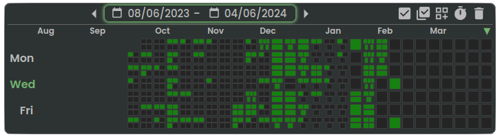

## Vsein Hanma
### Full-stack developer / Creator of:

<h1>
  
  <a href="https://neohabit.app/" target="_blank">Neohabit</a>
</h1>

<ul>
  <li>Is completely free</li>
  <li>Uses a systemic, gradual approach to building habits</li>
  <li>Is more flexible than calendars and regular habit-trackers</li>
  <li>Has a growing user-base</li>
  <li>The philosophy behind the project can be found on the <a href="https://neohabit.app/" target="_blank">landing</a></li>
  <li>More usage cases and more info is provided <a href="https://www.reddit.com/r/Habits/comments/1987g06/i_developed_an_app_with_a_gradual_systemic/" target="_blank">in my posts on reddit</a></li>
  <li>Examples of projects and habit representations like on github:</li>
</ul>

<!--
**Vsein/Vsein** is a ✨ _special_ ✨ repository because its `README.md` (this file) appears on your GitHub profile.

Here are some ideas to get you started:

- 🔭 I’m currently working on ...
- 🌱 I’m currently learning ...
- 👯 I’m looking to collaborate on ...
- 🤔 I’m looking for help with ...
- 💬 Ask me about ...
- 📫 How to reach me: ...
- 😄 Pronouns: ...
- ⚡ Fun fact: ...
-->
